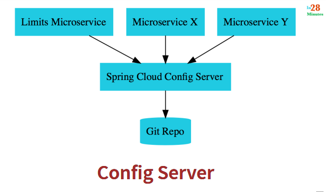

# limit-service
Writing a first simple microservice and configure it in ```application.properties```



source : https://courses.in28minutes.com/p/master-microservices-with-spring-boot-and-spring-cloud 

